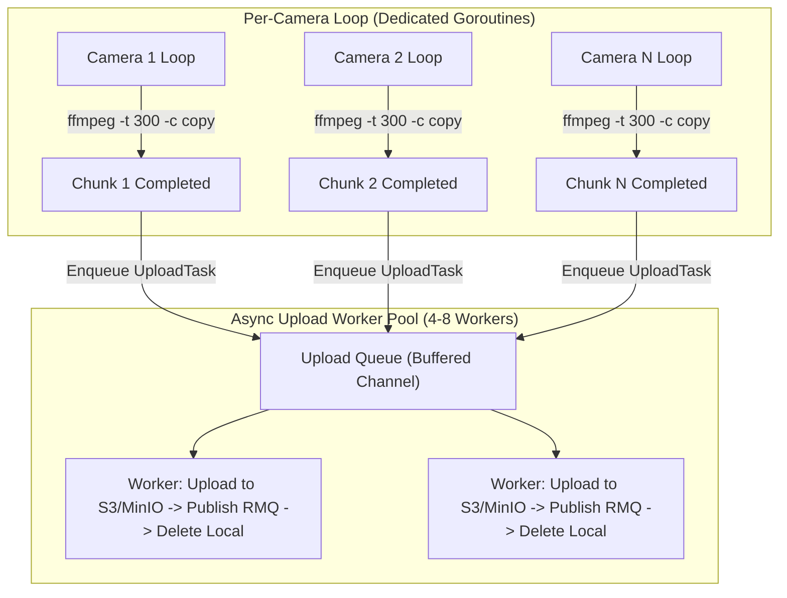

# [Refactor] Direct Chunk Recorder Loop & Async Upload Pool for Multi-Camera Scalability

## 📌 Background & Context
Previously, `worker-record` utilized continuous FFmpeg process segmentation (`-f segment -segment_time 300`) combined with a filesystem polling directory watcher (`watcher.go`) scanning `/opt/recordings/queue` every 5 seconds.

## ⚠️ Issues Identified with Continuous Segmenter + Polling
1. **File Finalization Race Conditions**:
   - The watcher poller relied on heuristic file modification timestamps and size delta tracking to guess when an MP4 file was completed.
   - When active recordings were in-flight, premature detection occasionally caused active MP4 segments to be uploaded and deleted while FFmpeg was still writing, causing missing `moov atom` trailers and corrupting playback.
2. **Trailer Flush Failures**:
   - FFmpeg segment muxer failed on file close when local files were touched or deleted by the watcher during write passes (`Error writing trailer ... Invalid argument`).
3. **High CPU & I/O Overhead on 20+ Cameras**:
   - Polling 20+ active camera directories every 5 seconds created unnecessary disk I/O and mutex contention.

---

## 🚀 Architectural Solution: Direct Chunk Recorder + Async Upload Pool

This pull request refactors `worker-record` into a clean, event-driven, and fault-tolerant architecture:

### Key Technical Improvements:
1. **Direct FFmpeg Lifecycle Control (`-t 300`)**:
   - Each camera Goroutine executes discrete 5-minute chunks using `ffmpeg ... -t 300 -c copy -movflags +faststart <filename>.mp4`.
   - Uses `cmd.Wait()` to guarantee that every MP4 file is 100% written, validated, and finalized with full `moov atom` headers before upload.
2. **Zero Gap Between Segments**:
   - When a 5-minute chunk finishes, the camera Goroutine instantly enqueues the file to the background `UploadPool` and immediately launches the next chunk with <50ms latency.
3. **Async Upload Worker Pool (`uploader/pool.go`)**:
   - Dedicated worker pool handles S3 uploads, RabbitMQ event dispatches, and local file cleanup asynchronously.
   - Fault-tolerant retries on transient network hiccups.
4. **Complete Removal of Directory Polling (`watcher.go`)**:
   - Eliminates polling loops, stale file trackers, and race conditions.
5. **100% Camera Fault Isolation**:
   - If a camera drops connection, only that camera's Goroutine enters backoff retry without affecting any other camera streams.
